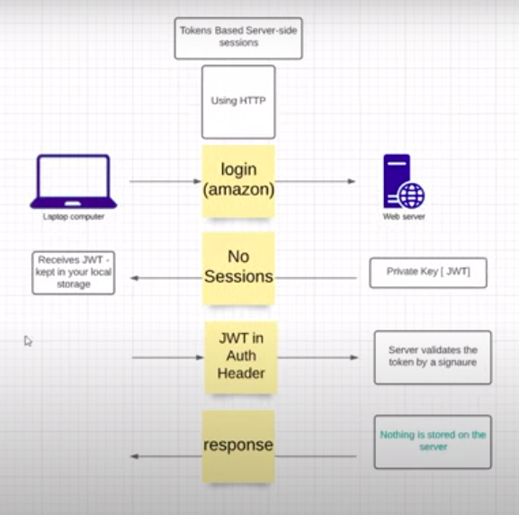

User-Authentication using JWT
==

## User Authentication using Traditional Approach 

- Stores the session in DB and generates `Session ID` for each session of the User (sent to client - browser from server)

- Session ID is saved in Cookie 
    - cookie is a text file saved in your local storage in the browser

    - it is in the form of key-value pair

- The cookie is sent to server for every subsequent requests made by the client. This is called _**STATEFUL protocol**_ between front-end client (browser) and back-end server
    - STATEFUL protocol - saves everything in the back-end
    
    - STATELESS protocol - saves everything in the front-end client


- Authentication state handled on the server

- Has security issues. Easy for attackers to point to your account

    

## User Authentication using JSON Web Tokens (JWT)

- Server generates `JWT` (sent to client)

- Stored in the local storage in the browser

- On subsequent requests, the JWT is placed along with authorization header prefixed by the bearer of the token

- Server needs to validate the JWT signature

- JWT handled on the client side


    

## jwt.io

- allows you to decode, verify and generate JWT

- password hashing method used : hs256

- JWT has 3 sections :

    - Header (has algorithm and type of token)

    - Payload (has actual data)

    - Verify Signature (signature along with secret key)

## Approaches to get a secure secret key 

- ### random() method in os module

    ```python
    import os
    os.random(12)
    ```

- ### uuid4() method in uuid module

    ```python
    import uuid
    uuid.uuid4().hex
    ```

- ### secrets module

    ```python
    import secrets
    secrets.token_urlsafe(12)
    ```

## Python libraries to be used

- flask 

- jwt

- datetime

- functools

## Example of authentication of user via login page 

[Login Page using Flask and JWT](https://github.com/priyaskumar/User-Authentication-Using-JWT/blob/master/app.py)


